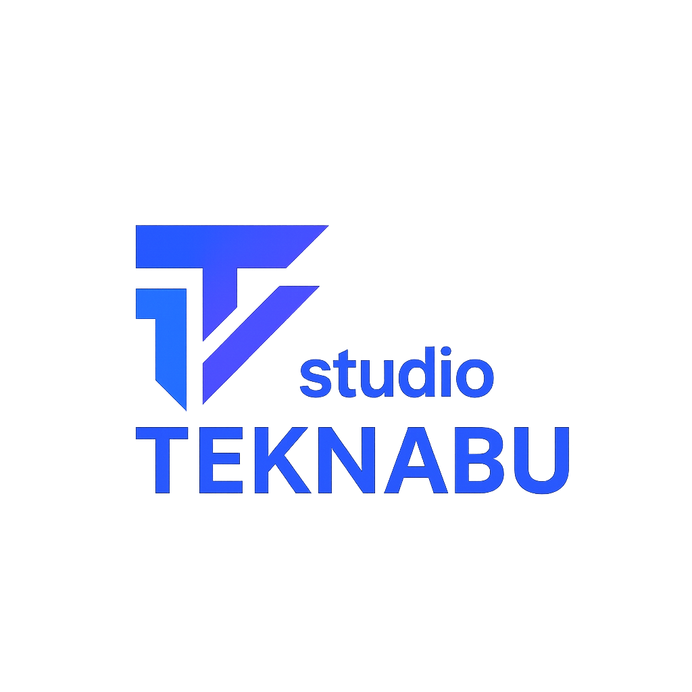

<!-- Branded hero -->

  

    

      
    

    <h1 class="hero__title">Windows11 + Powershell Lab</h1>
    

      A living reference for mastering <strong>Windows OS</strong> and <strong>PowerShell</strong> —
      built from hands-on experiments in a virtual machine and evolving notes from daily practice.
    

    <!-- Snapshot of purpose (HTML list to render inside hero) -->
    <ul style="list-style:none; padding:0; margin:0 0 1.25rem; line-height:1.6;">
      <li>🗂️ <strong>Single source of truth</strong> for my Windows + PowerShell knowledge</li>
      <li>⚙️ <strong>Repeatable steps</strong> for installs, config, and troubleshooting</li>
      <li>📈 <strong>Progressive learning path</strong> from fundamentals to real workflows</li>
      <li>📜 <strong>Changelog</strong> tracks every VM snapshot &amp; change (<a href="changelog.md">view</a>)</li>
    </ul>
    

      <a class="cta-button" href="changelog.md">
        📜 View Changelog
      </a>
      <a class="cta-button cta-button--ghost" href="#what-youll-find">
        🧭 Explore Sections
      </a>
    

  

> 💡 The **[Changelog](changelog.md)** is a step-by-step record of my VM lab builds, snapshots, and configuration changes. It’s the running diary of this entire journey.

## 📖 What You’ll Find

- **Guides** (`/guides/`)  
  Step-by-step instructions for installs, tools, features, and security tasks.  

- **Notes** (`/notes/`)  
  Focused learning notes for Windows 11 features (e.g., Task Scheduler, Services, Event Viewer).  

- **PowerShell** (`/powershell/`)  
  Hands-on learning notes covering core concepts, commands, and administration tasks.  

- **Scripts** (`/scripts/`)  
  Example scripts you can adapt and run in your own environments.  

- **Cheatsheet** (`/cheatsheet/`)  
  Quick PowerShell syntax and examples for faster script writing.  

!!! tip
    Each section is designed to grow over time — start small, then expand as the lab evolves.  

---